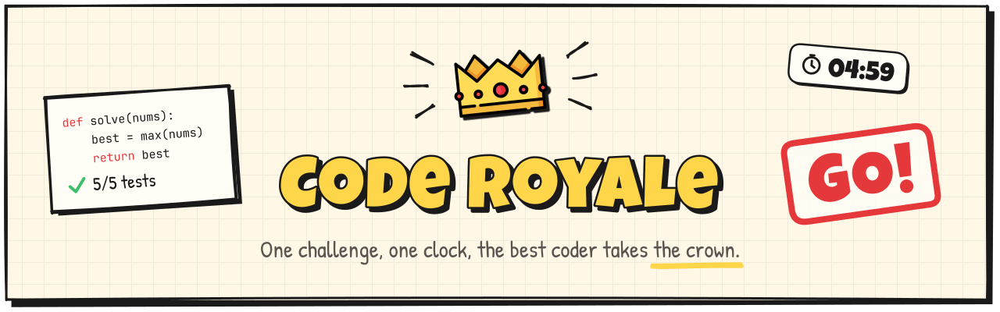
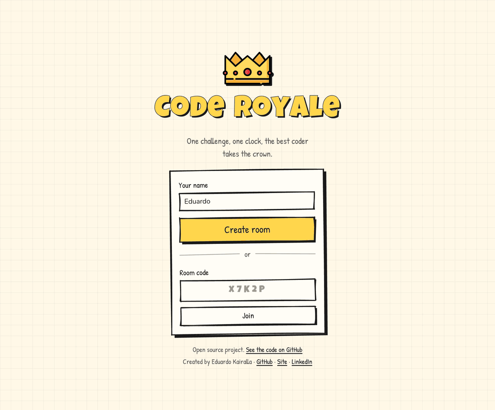
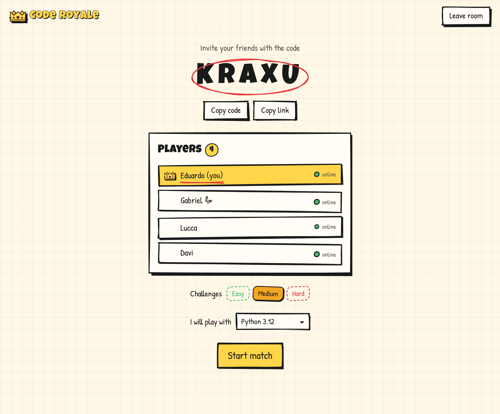
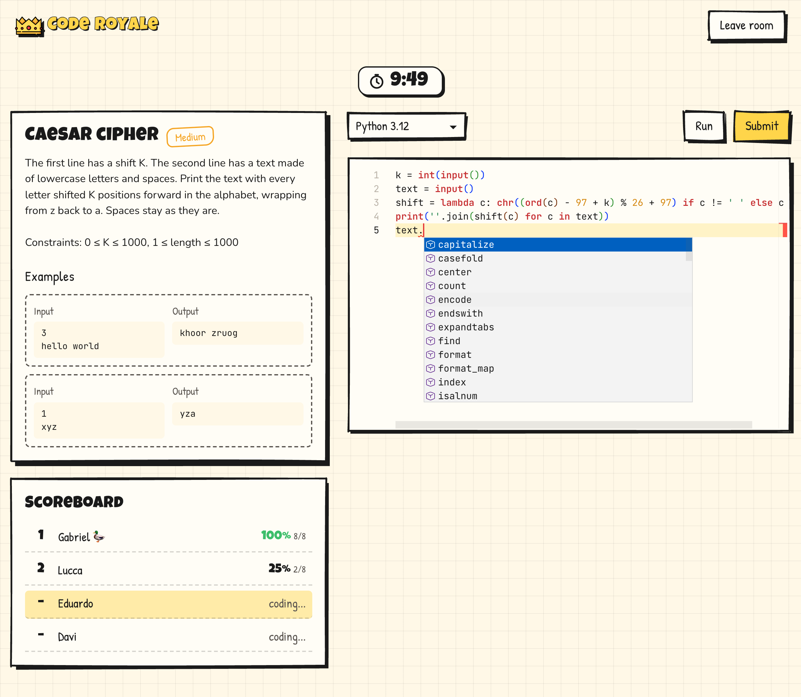
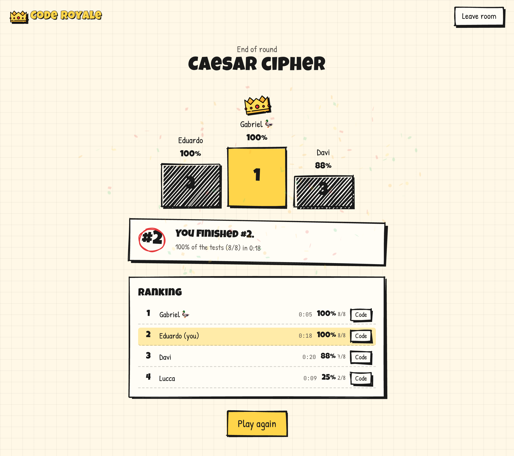
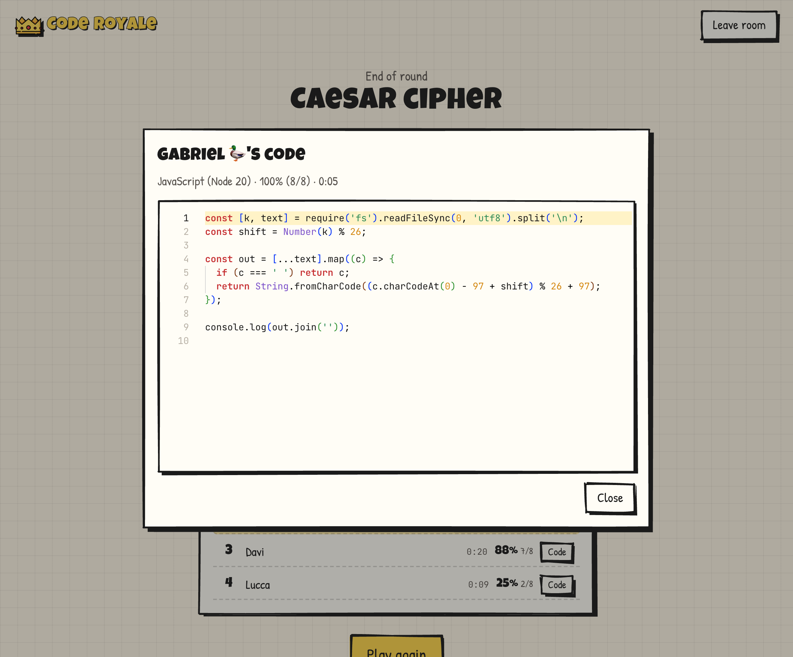

[](https://github.com/eduardokairalla1/code-royale/actions/workflows/release.yaml)


[](LICENSE)

A multiplayer coding game. I made it because my friends and I wanted a
good coding game to play in our spare time.

Play it at **[coderoyale.app](https://coderoyale.app)**.



## A match

1. Create a room and share its code or link with your friends.
2. The host picks the difficulties, easy, medium, hard or any mix, and
   starts the round.
3. Everyone gets the same challenge and the same clock. Write your
   solution in Python, JavaScript, TypeScript, Go, Java, C, C++ or Rust,
   with autocomplete, and run it against the examples as often as you
   like.
4. You submit once, against hidden tests. When time runs out, whatever is
   in your editor is submitted for you.
5. The most tests passed wins, the fastest submission breaks ties. Then
   read everyone's code and play again.

| Lobby | Playing |
|---|---|
|  |  |

| Results | Everyone's code |
|---|---|
|  |  |

## How it works

```
browser ──http, Socket.IO──▶ backend ──▶ Piston (runs the code)
                                 │
                                 ▼
                               Redis (rooms, rounds, timers)
                                 ▲
        ──websocket────────▶ lsp service (autocomplete)
```

| Part | What it is | Stack |
|---|---|---|
| [frontend](frontend/) | the game's pages | React, TypeScript, Vite, Monaco |
| [backend](backend/) | rooms, rounds, judging | Node, TypeScript, Fastify, Socket.IO, Redis |
| [lsp](lsp/) | a language server per editor | Go, Redis |
| [deploy](deploy/) | Docker Compose for the whole thing | Docker, Piston, Redis |

Player code runs in [Piston](https://github.com/engineer-man/piston), self hosted.

## Tech stack

| Layer | Technology |
|---|---|
| **Languages** | TypeScript (backend, frontend), Go (lsp) |
| **Frontend** | React 19 + Vite, React Router |
| **Editor** | Monaco, with autocomplete over the Language Server Protocol |
| **Look** | Rough.js and Rough Notation (hand-drawn), Motion, Radix UI |
| **Backend** | Node 24, Fastify |
| **Realtime** | Socket.IO, with the Redis adapter across instances |
| **State** | Redis: rooms, rounds, timers, locks |
| **Code runner** | Piston, self hosted |
| **Language servers** | pyright, typescript-language-server, gopls, clangd, rust-analyzer, jdtls |
| **Containers** | Docker Compose, nginx for the frontend |
| **CI** | GitHub Actions, images on Docker Hub |

## Running it

You need Docker with Compose v2 and about 12 GB of disk.

```bash
cd deploy
cp .env.example .env     # set LSP_SECRET: openssl rand -hex 32
docker compose up -d --build
```

The first start takes a few minutes while Piston installs the languages.
Then open http://localhost:8080.

To work on the code, run Piston in Docker and the services on your
machine. [deploy/README.md](deploy/README.md#development) has the steps,
and each part's README covers its own settings.

## Repository

```
backend/       # game server; challenges/ holds the challenge files
frontend/      # web client
lsp/           # language server service
deploy/        # compose files and Piston config
docs/          # code guidelines and images
.github/       # CI: tests, and images for Docker Hub
VERSION        # release version, used in the image tags
```

## Adding a challenge

Add a json file to `backend/challenges/` with a statement, examples and
hidden tests. The format is in
[backend/README.md](backend/README.md#challenges).

## Tests

```bash
cd deploy && docker compose -f docker-compose.yaml \
  -f docker-compose-dev.yaml up -d redis   # backend and lsp tests need it
cd backend && npm test
cd frontend && npm test
cd lsp && go test ./...
```

CI runs them on every pull request and again on every merge to `main`.

## License

[MIT](LICENSE)
